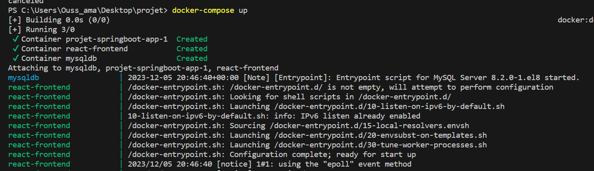
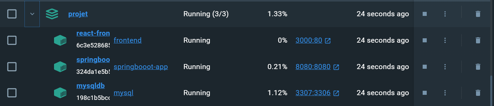
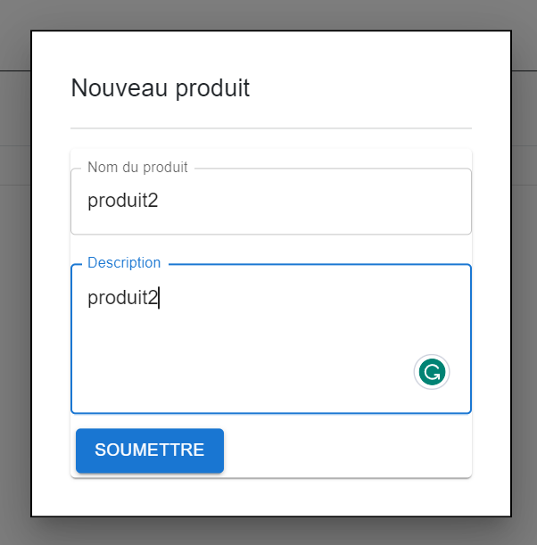
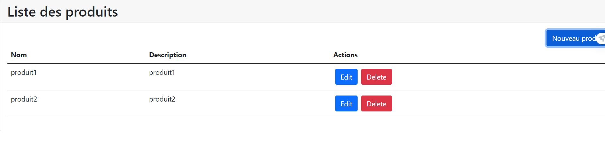

# Containerisation d'une Application React.js, Spring Boot et MySQL avec Docker
# OUHAYOU OUSSAMA
## Prérequis
Assurez-vous d'avoir les outils suivants installés sur votre machine :
- Docker
- Docker compose

## Étapes

### 1. Structure du Projet
Organisez votre projet de la manière suivante : 

├── backend/
│   ├── Dockerfile
│   └── (autres fichiers backend)
├── frontend/
│   ├── Dockerfile
│   └── (autres fichiers frontend)
├── docker-compose.yml
└── README.md


### 2. Dockerfile pour le Frontend (React.js)
Créez un fichier Dockerfile dans le dossier `frontend` :
```Dockerfile

FROM node:14 AS build

WORKDIR /app

COPY package*.json ./

RUN npm install

COPY . .

RUN npm run build

FROM nginx:alpine

COPY --from=build /app/build /usr/share/nginx/html

EXPOSE 80

CMD ["nginx", "-g", "daemon off;"]

```

### 3. Dockerfile pour le Backend (Spring Boot)
Créez un fichier Dockerfile dans le dossier `frontend` :
```Dockerfile
FROM openjdk:8-alpine
ADD target/*.jar app.jar
ENTRYPOINT ["java","-jar","app.jar"]
```


### 4. Configuration de Docker Compose
Créez un fichier docker-compose.yml à la racine du projet 
```docker-compose.yml
version: "3"
services: 
  springboot-app:
   # container_name: spring-app
    image: springbooot-app
    restart: always
    build: ./backend
    ports:
      - 8080:8080 
    environment:
      MYSQL_HOST: mysqldb
      MYSQL_USER: root
      MYSQL_PASSWORD: root
      MYSQL_PORT: 3306
  mysqldb: 
    container_name: mysqldb
    image: mysql
    ports: 
     - 3307:3306   
    environment:
      MYSQL_DATABASE: test
      MYSQL_ROOT_PASSWORD: root

  react-frontend:
    container_name: react-frontend
    image: frontend
    build: ./frontend
    ports:
      - 3000:80
```

### 5. Construire et Exécuter les Conteneurs
Lancez la commande docker-compose up

Tapez dans votre navigateur l'URL suivante : http://localhost:3000/


### 6. Interface


